# BidSense — Exploratory Data Analysis

*Auto-generated by `eda/generate_eda.py`. Every figure and statistic is computed
directly from the provided datasets; re-run the script to regenerate.*

## Datasets

| Dataset | Rows | Columns | Notes |
|---|---|---|---|
| Bid history | 120 | 12 | Past bids with outcome, awarded score, and bid attributes |
| Capability library | 50 | 8 | Company's past-project records used as RAG evidence |
| Criteria taxonomy | 16 | — | 16 evaluation criteria, **synthesized by the team** (the sample dataset omitted the sheet the problem statement referenced) |

---

## 1. Bid history

### 1.1 Outcome balance
The dataset is close to balanced: **68 wins / 52 losses**
(win rate **56.7%**), so accuracy is a meaningful metric and no
heavy class re-weighting is required.

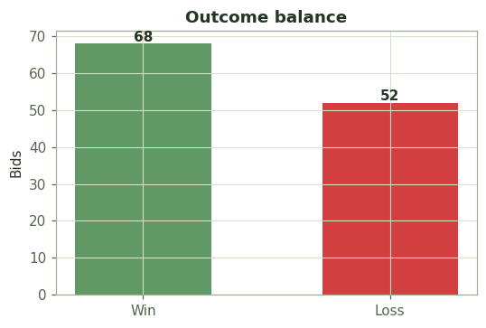

### 1.2 Feature summary

| Feature | mean | std | min | median | max |
|---|---|---|---|---|---|
| Score (%) | 71.5 | 15.1 | 45 | 72 | 96 |
| Compliance % | 78.7 | 11.7 | 60 | 77 | 100 |
| Gaps Found | 4.0 | 2.5 | 0 | 4 | 8 |
| Response Time (hrs) | 95.6 | 41.7 | 25 | 91 | 168 |
| Doc Pages | 240.8 | 124.8 | 30 | 251 | 450 |
| budget_m | 270.6 | 141.8 | 11 | 266 | 500 |

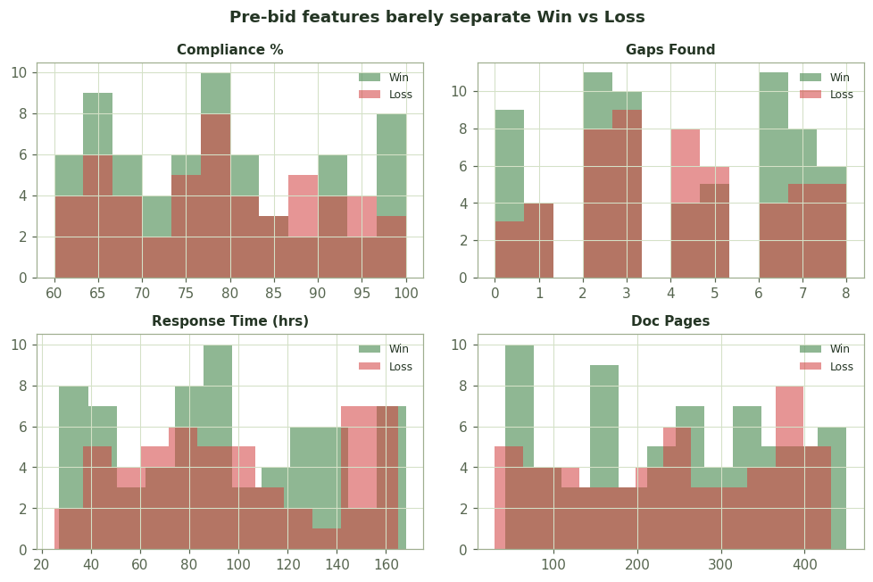

The four operational pre-bid features (compliance, gaps, response time, document
pages) show **heavily overlapping** Win/Loss distributions — visually, none of them
cleanly separates the classes.

### 1.3 The dominant signal: awarded evaluation score
This is the headline finding. Winners average **82.8%** on the
awarded score; losers average **56.7%**. The score also carries
a hard threshold around **70**:

- Win rate **below** score 70: **0%**
- Win rate **at/above** score 70: **100%**
- A naive "score ≥ 70 → Win" rule misclassifies only **0 of 120** bids.

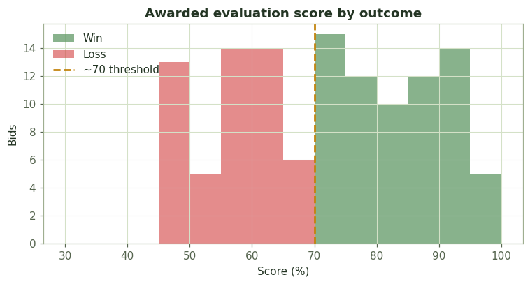
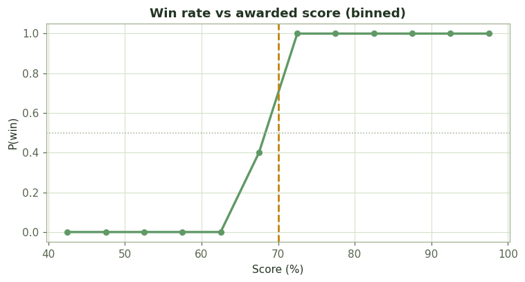

### 1.4 Correlation with outcome
The awarded score dwarfs every other feature in its correlation with winning:

| Feature | corr with Win |
|---|---|
| Score (%) | +0.859 |
| budget_m | +0.093 |
| Response Time (hrs) | -0.068 |
| Compliance % | -0.029 |
| Doc Pages | -0.020 |
| Gaps Found | -0.015 |

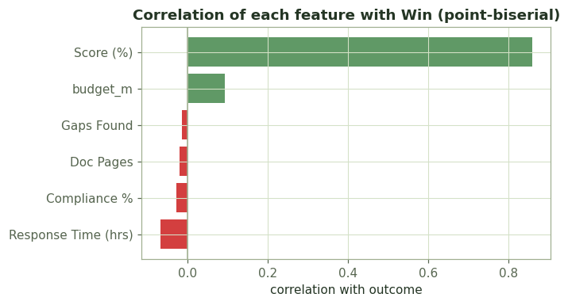
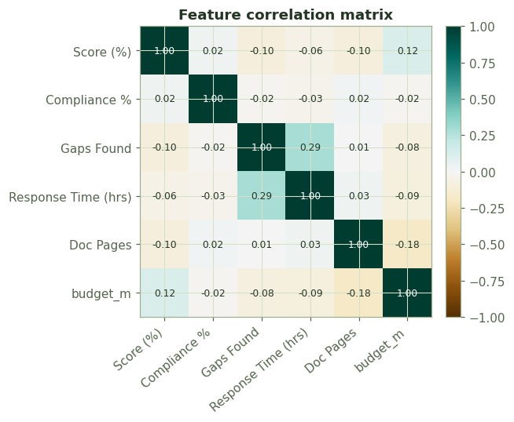

Compliance % and the awarded score are only weakly correlated
(r = 0.02), confirming that compliance coverage is a
*partial* input to the score, not a substitute for it.

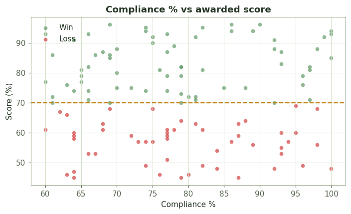

### 1.5 Sector and budget
Win rate varies by sector, but on small per-sector samples (treat as weak priors,
not hard rules):

| Sector | win rate | n |
|---|---|---|
| Energy | 65% | 20 |
| Telecom | 65% | 17 |
| Logistics | 60% | 10 |
| Construction | 57% | 23 |
| Healthcare | 55% | 11 |
| Finance | 54% | 13 |
| IT Services | 50% | 12 |
| Education | 43% | 14 |

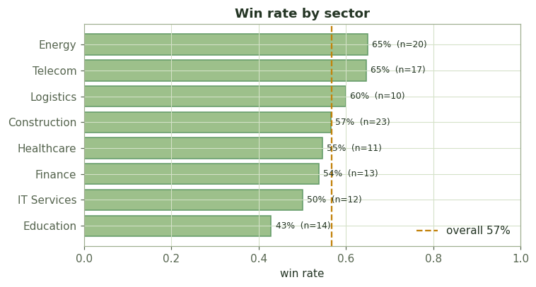
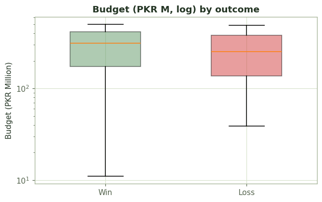

Budget distributions for wins and losses overlap substantially — deal size alone
does not decide the outcome.

---

## 2. Capability library

The company holds **50 capability records across 12 domains**,
completed between **2019–2025**, with a median contract
value of **PKR 114M** (max PKR 200M).

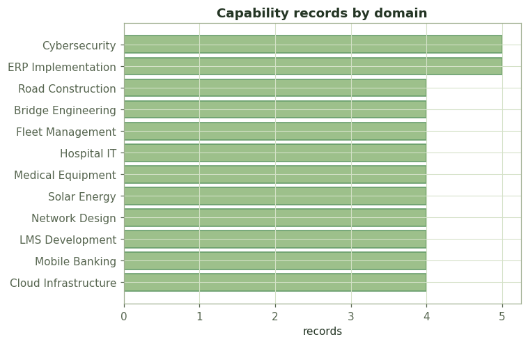

**Certifications:** only **80%** of records carry a stated
certification — a real signal, because tenders that demand a specific certification
the company lacks become hard compliance GAPs (this is what drives the demo's
CONDITIONAL_GO and NO_GO decisions).

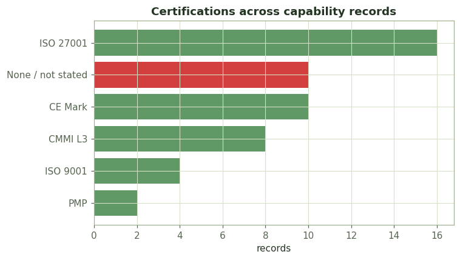
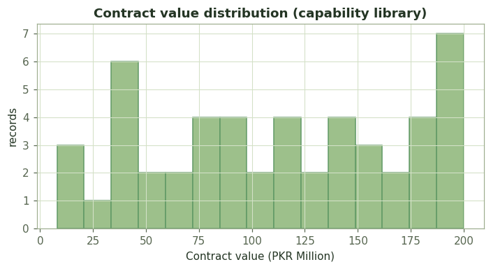
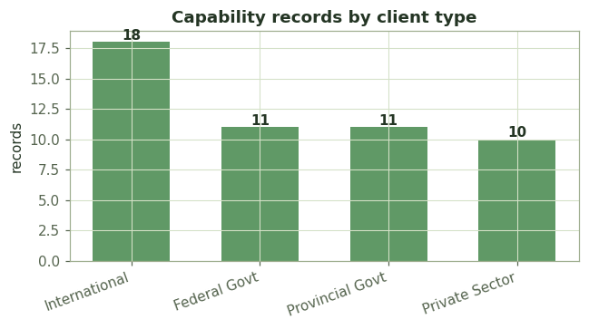

---

## 3. Criteria taxonomy

16 evaluation criteria, synthesized to replace the missing dataset sheet, with a
typical weight range of **3–25%**. Sample entries:

| ID | Criterion | Typical weight |
|---|---|---|
| TC-01 | Technical Approach & Methodology | 25% |
| TC-02 | Relevant Past Experience | 15% |
| TC-03 | Financial Proposal / Cost | 20% |
| TC-04 | Key Personnel Qualifications | 10% |
| TC-05 | Project Timeline & Work Plan | 8% |
| TC-06 | Quality Assurance Plan | 5% |

---

## 4. Modeling implications

The EDA directly shapes the win-probability design:

1. **The outcome is near-deterministic in one feature (awarded score, threshold ~70).**
   That is why the trained classifier reaches a near-perfect *cross-validated* AUC —
   it is learning a real, almost-trivial rule, not memorizing rows.
2. **Pre-bid features alone are noise** (Section 1.2 / 1.4). The published ablation
   confirms this: drop the score and AUC collapses to ≈ coin-flip.
3. **Leakage caveat → two-stage design.** The awarded score is only known *after*
   evaluation, so it cannot be a live input. The engine therefore estimates the
   expected score (Stage B) from compliance coverage, sector win-rate priors and
   budget alignment, then maps that estimate to win probability with the trained model.
4. **Compliance and certifications are the actionable levers** the company controls
   pre-bid — which is exactly what the matcher and the score estimator key on.

*Reproduce:* `python eda/generate_eda.py` from `projects/bid-engine/`.
